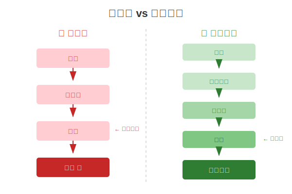
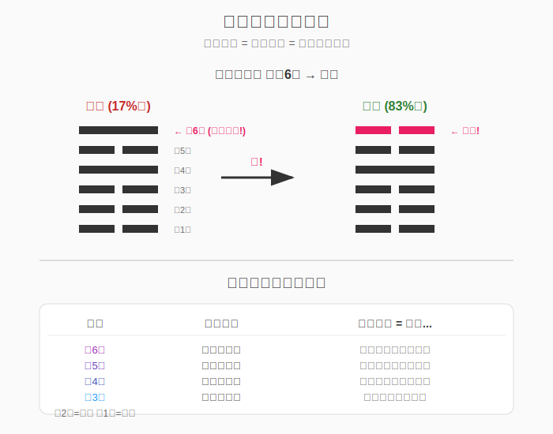
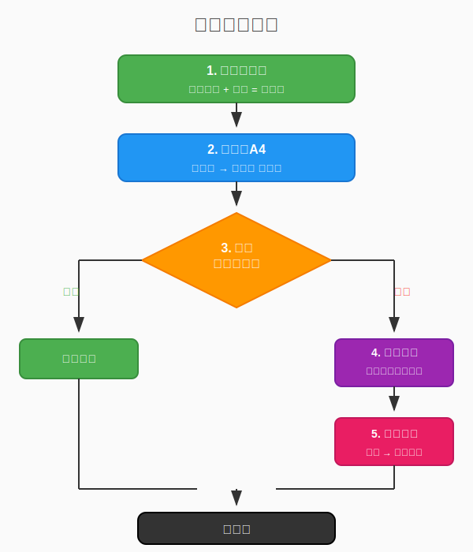

# 第十四章：決策框架：五步法

---

## 大多數人用錯了易經



**為什麼卡住？**

| 原因 | 結果 |
|------|------|
| 不知道卦有「類型」| 不知道該留還是走 |
| 不知道有「路徑」| 不知道往哪走 |
| 不知道有「時機」| 不知道什麼時候動 |
| 把易經當算命 | 被動等待 |

---

## 完整使用流程（從頭到尾）

這是使用本書的完整流程，一步一步跟著做：

### 第一步：確定你的卦（你在哪裡？）

**方法A：占卦**
- 用任何傳統方法（銅錢、蓍草、App）
- 得到一個卦

**方法B：自我判斷（推薦）**
- 不需要占卜，直接分析你的處境
- 問自己：「我的內在狀態像什麼？外在環境像什麼？」
- 用下面的表格對照

```
內在狀態（下卦）：
乾 = 我想衝、想領導、精力充沛
坤 = 我想配合、想支持、願意等待
震 = 我想行動、想突破、有衝動
巽 = 我想慢慢來、想滲透、想低調
坎 = 我覺得困難重重、壓力大
離 = 我想被看見、想表現、想依附
艮 = 我想停下來、想休息、有底線
兌 = 我想交流、想開心、重視關係

外在環境（上卦）：
乾 = 競爭激烈、機會很多、需要領導
坤 = 穩定、要順從、支持性環境
震 = 變化快、要快反應、有壓力
巽 = 可以慢慢滲透、低調環境
坎 = 危機四伏、要小心、有陷阱
離 = 很透明、被關注、公開環境
艮 = 有阻礙、需要等待、有界限
兌 = 關係導向、要社交、愉快氛圍
```

**組合成卦**：上卦 + 下卦 = 你的卦

例：內在想休息（艮）+ 外在要順從（坤）= 坤上艮下 = 謙卦

### 第二步：查A4（這是什麼類型？）

翻到**附錄A4**，找到你的卦。

```
例：找到「師卦」

| 7 | 師 | 17% | 🔴 | 走 | 6→臨 |
  ↑    ↑     ↑    ↑    ↑     ↑
卦序  卦名  吉率  類型 建議  最佳變爻
```

**類型解讀**：
- 🟢 = 好地方，留下
- 🟡 = 普通，觀望
- 🔴 = 該走了，改變
- ⚠️ = 陷阱，謹慎選

### 第三步：決定行動（該留還是該走？）

根據類型決定基本策略：

| 看到 | 意思 | 行動 |
|:----:|:-----|:-----|
| 🟢 留 | 這裡比周圍好 | 維持現狀，不要亂動 |
| 🟢 守 | 吉率高 | 穩定發展 |
| 🟡 觀 | 中等 | 觀察等待，不急著動 |
| 🔴 走 | 這裡差，周圍好 | 趕快改變 |
| 🔴 變 | 吉率低 | 需要改變 |
| ⚠️ 慎 | 周圍也差 | 謹慎選擇方向 |

### 第四步：看路徑（往哪走？怎麼變？）

如果建議是「走」或「變」，看**最佳變爻**欄。



**什麼是「變爻」？**

每個卦有6條線（爻）。「變」一條線，就會變成另一個卦。

當你在A4看到「6→臨」，意思是：
- 「6」= 改變第6爻（最上面那條線）代表的事情
- 「臨」= 改變後會進入「臨卦」的狀態

**六個爻位分別代表什麼？**

| 爻位 | 代表層面 | 生活中的意思 |
|:----:|:---------|:-------------|
| 6 | 終結、轉型 | 如何結束、如何轉型 |
| 5 | 主導、核心 | 核心策略、主導方式 |
| 4 | 適應、調整 | 外在調整、適應環境 |
| 3 | 轉折、決定 | 關鍵決定、轉折點 |
| 2 | 發展、內在 | 發展方向、內在態度 |
| 1 | 起步、根本 | 根本基礎、起點 |

---

### 變爻實例解析

**例1：師卦 → 臨卦（變第6爻）**

| 項目 | 內容 |
|:-----|:-----|
| 情境 | 小陳帶團隊，像在打仗，壓力大 |
| 查A4 | 師卦 17%吉 → 🔴走 → 6→臨 |
| 第6爻 | 代表「終結、轉型」|
| 行動 | 結束「打仗」狀態，轉向主動面對 |
| 具體 | 停止內耗、主動找老闆溝通、提出解決方案 |
| 結果 | 師(17%) → 臨(83%) |

**例2：觀卦 → 比卦（變第1爻）**

| 項目 | 內容 |
|:-----|:-----|
| 情境 | 小美一直旁觀，不敢參與 |
| 查A4 | 觀卦 0%吉 → 🔴走 → 1→比 |
| 第1爻 | 代表「起步、根本」|
| 行動 | 從根本改變，開始參與 |
| 具體 | 踏出第一步、加入團隊、主動發言 |
| 結果 | 觀(0%) → 比(67%) |

**例3：困卦 → 訟卦（變第1爻）**

| 項目 | 內容 |
|:-----|:-----|
| 情境 | 小王陷入困境，動彈不得 |
| 查A4 | 困卦 17%吉 → 🔴走 → 1→訟 |
| 第1爻 | 代表「起步、根本」|
| 行動 | 從根本處改變，明辨是非 |
| 具體 | 找出問題根源、該爭取的要爭取 |
| 結果 | 困(17%) → 訟(67%) |

**例4：節卦 → 臨卦（變第2爻）**

| 項目 | 內容 |
|:-----|:-----|
| 情境 | 小李過度節制，什麼都不敢做 |
| 查A4 | 節卦 17%吉 → 🔴走 → 2→臨 |
| 第2爻 | 代表「發展、內在」|
| 行動 | 改變內在態度，從限制變主動 |
| 具體 | 調整心態、主動出擊、不再過度保守 |
| 結果 | 節(17%) → 臨(83%) |

---

### 變爻口訣

```
看到 X→某卦：

X = 改變哪個層面
  1 = 根本（從頭開始）
  2 = 內在（調整心態）
  3 = 決定（關鍵選擇）
  4 = 調整（適應環境）
  5 = 核心（改變策略）
  6 = 轉型（結束舊的）

某卦 = 改變後的狀態
```

### 第五步：具體行動

把「爻位」翻譯成具體行動。

**完整範例**：

```
小陳情況：團隊士氣低落，像在打仗
判斷：師卦狀態
查A4：師卦 | 17% | 🔴 | 走 | 6→臨

解讀：
- 類型🔴 = 要離開這個狀態
- 6→臨 = 改變「終結/轉型」層面
- 臨卦 = 主動面對的狀態

行動翻譯：
- 第6爻 = 終結、轉型
- 所以要思考：如何結束「打仗」？
- 具體行動：
  1. 結束消耗戰（停止內耗）
  2. 主動找老闆談（從被動變主動）
  3. 提出解決方案（從應戰變出擊）

結果：師卦17% → 臨卦83%
```

### 流程圖



---

## 從理論到實踐

前面13章，我們學習了易經的結構和規律。

現在，讓我們把這些知識整合成一個**可操作的決策框架**。

這個框架不需要你會占卜、會算卦。它只需要你理解處境，然後用結構性思維分析。

---

## 核心原則：吉 = 選擇權

在進入五步法之前，記住這個最重要的原則：

```
吉 = 變化的空間 = 自由 = 選擇權
```

這就像：
- **金錢** — 可以換成任何你需要的東西
- **自由** — 可以走任何你想走的路
- **健康** — 可以做任何你想做的事

易經的「吉」，就是這種「選擇的可能性」。

> **沒有選擇 = 窮 = 凶**
> **有選擇 = 通 = 吉**

所以在做決策時，核心問題是：

> **這個選擇會增加還是減少我的選擇空間？**

選擇空間增加 → 傾向做
選擇空間減少 → 謹慎考慮

---

## 五步決策法

```
══════════════════════════════════════════════════
                                                        
     Step 1: 確定你的「卦」— 識別內外狀態                
                                                        
     Step 2: 找到你的「位置」— 判斷發展階段              
                                                        
     Step 3: 評估結構傾向 — 查看數據規律                
                                                        
     Step 4: 識別風險點 — 知道什麼要注意                
                                                        
     Step 5: 制定策略 — 採取適當行動                    
                                                        
══════════════════════════════════════════════════
```

讓我們逐步講解。

---

## Step 1：確定你的「卦」

### 識別下卦（內在狀態）

問自己這些問題：

```
我目前的內在狀態像什麼？

乾（天）= 剛健、有創造力、想領導
坤（地）= 順從、配合、想支持
艮（山）= 想停下、需要休息、有底線
兌（澤）= 愉快、想交流、重視關係
離（火）= 想被看見、追求光明、依附他人
坎（水）= 面臨險阻、需要智慧、處境困難
震（雷）= 想行動、想突破、有動力
巽（風）= 想滲透、漸進、柔和推進
```

選一個最像你目前狀態的。

### 識別上卦（外在環境）

問自己這些問題：

```
外在環境像什麼？

乾（天）= 充滿機會、需要領導力、競爭激烈
坤（地）= 需要順從、穩定的環境、服從為主
艮（山）= 有阻礙、需要停下、有界限
兌（澤）= 關係導向、需要交流、社交環境
離（火）= 公開透明、被關注、需要形象
坎（水）= 危機四伏、充滿挑戰、需要智慧
震（雷）= 變化快速、需要行動、有突破機會
巽（風）= 可以滲透、漸進式環境、柔和氛圍
```

選一個最像你目前環境的。

### 組合成你的卦

```
你的卦 = (上卦, 下卦)

例如：
- 你內在想停下休息（艮），外在環境需要順從（坤）
- 你的卦 = 坤上艮下 = 謙卦
```

---

## Step 2：找到你的「位置」

### 判斷發展階段

```
位置1（潛伏期）：
- 事情剛開始
- 還在準備階段
- 能力還在積累

位置2（成長期）：
- 開始有成果
- 正在建立信譽
- 穩步發展中

位置3（轉折期）：
- 到了關鍵節點
- 需要做重大決定
- 舊的結束，新的開始

位置4（適應期）：
- 進入新領域
- 在學習新規則
- 接近更高層次

位置5（巔峰期）：
- 處於最佳狀態
- 有地位有資源
- 可以發揮影響力

位置6（極端期）：
- 已經到頂
- 沒有上升空間
- 需要考慮轉型或退出
```

選擇最符合你當前階段的位置。

---

## Step 3：評估結構傾向

### 查看位置的基本傾向

```
位置    吉率    凶率    傾向
──────────────────────────────
1      39.1%   15.6%   中性，等待
2      45.3%   10.9%   偏吉，發展
3      10.9%   32.8%   偏凶，謹慎！
4      34.4%    7.8%   過渡，適應
5      48.4%    6.2%   最吉，發揮
6      29.7%   26.6%   偏凶，轉型
```

### 查看上下卦組合

```
上卦是坤嗎？
→ 如果是，外在謙虛是好姿態（+）

下卦是艮嗎？
→ 如果是，內在穩固是好基礎（+）

上卦是兌或巽嗎？
→ 如果是，注意外在輕浮的風險（-）
```

### 計算互補指數

上下卦有幾個維度不同？（詳見第十章）

```
0維度 → 完全相同，吉率31%
2維度 → 適度差異，吉率54%（最佳）
3維度 → 完全相反，吉率42%
```

---

## Step 4：識別風險點

### 位置相關的風險

```
位置1：急於表現、時機不成熟
位置2：沒有大風險，但不要自滿
位置3：最大風險！轉折失敗、決策錯誤
位置4：新環境適應不良、不懂新規則
位置5：風險最低，但要防驕傲
位置6：戀棧不退、物極必反
```

### 結構相關的風險

```
上卦是兌：外在輕浮
上卦是巽：沒有定性
下卦是坎：內在處境艱難
互補指數高：內外衝突大
```

### 制定風險清單

```
我的風險清單：
□ 位置3的風險：_________________
□ 上卦的風險：_________________
□ 下卦的風險：_________________
□ 組合的風險：_________________
```

---

## Step 5：制定策略

### 根據位置選擇基本策略

```
位置1 → 等待策略
- 不要急於行動
- 專注學習和積累
- 默默打好基礎

位置2 → 發展策略
- 穩紮穩打
- 建立信譽
- 展現但不張揚

位置3 → 謹慎策略
- 小心做決定
- 控制節奏
- 準備好應對變化

位置4 → 適應策略
- 學習新規則
- 謙虛觀察
- 不要急於表現

位置5 → 發揮策略
- 承擔責任
- 保持謙虛
- 開始考慮傳承

位置6 → 轉型策略
- 知道何時退
- 準備傳承或轉型
- 不要戀棧
```

### 根據風險調整策略

```
如果有位置3的風險 → 加倍謹慎
如果上卦是兌/巽 → 增加穩重感
如果下卦是坎 → 用智慧應對
如果互補指數高 → 整合內外差異
```

---

## 完整案例：職業決策

### 情境

小王是一家公司的高級工程師，正在考慮是否接受升職為技術主管。

### Step 1：確定「卦」

**內在狀態（下卦）：**
- 有技術能力，但不確定想不想管人
- 有些猶豫
- → 艮（山）— 想停下來思考

**外在環境（上卦）：**
- 公司正在擴張，需要管理人才
- 老闘很支持他
- → 乾（天）— 充滿機會

**他的卦 = 乾上艮下 = 大畜卦**

### Step 2：找到「位置」

- 他在公司工作5年，技術上是資深
- 但管理上是新手
- 如果接受升職，他會進入「新領域」

**位置 = 4（適應期）** — 即將進入上卦領域

### Step 3：評估結構傾向

```
位置4：吉率13.3%，凶率26.7%
→ 略偏凶，因為是適應期

上卦乾：33.3%吉率
→ 中等

下卦艮：58.3%吉率（下卦最佳！）
→ 好基礎

互補指數 = 2維度差異
→ 較大差異，有挑戰
```

### Step 4：識別風險點

```
□ 位置4的風險：不適應新環境的規則
□ 上卦乾的風險：競爭激烈，壓力大
□ 互補指數高的風險：內外差異較大
□ 特別注意：他內在想「停」（艮），外在要「動」（乾）
```

### Step 5：制定策略

**基本策略：適應策略**
- 接受升職，但謙虛學習管理技能
- 不要急於證明自己
- 花時間觀察和理解管理工作

**風險應對：**
- 互補指數高（內外有差異）→ 找到平衡點：可以保留技術工作的同時逐步增加管理責任
- 內在「艮」→ 給自己時間適應，設定合理期望

**具體行動：**
1. 接受升職，但和老闘談好過渡期
2. 前3個月以學習為主，不做大變動
3. 找一個管理導師
4. 保留20%時間做技術，保持內在平衡

---

## 框架速查表

```
══════════════════════════════════════════════════
                   五步決策法速查                         
──────────────────────────────────────────────────
                                                        
   Step 1: 確定卦                                        
   - 內在像什麼八卦？→ 下卦                              
   - 外在像什麼八卦？→ 上卦                              
                                                        
   Step 2: 找位置                                        
   - 1=潛伏 2=成長 3=轉折 4=適應 5=巔峰 6=極端           
                                                        
   Step 3: 評估傾向                                      
   - 查位置吉凶率                                        
   - 查上下卦組合                                        
   - 算互補指數                                            
                                                        
   Step 4: 識別風險                                      
   - 位置風險是什麼？                                    
   - 結構風險是什麼？                                    
                                                        
   Step 5: 制定策略                                      
   - 選基本策略（等待/發展/謹慎/適應/發揮/轉型）         
   - 根據風險調整                                        
                                                        
══════════════════════════════════════════════════
```

---

## 小結

> **五步決策法**
>
> | 步驟 | 內容 |
> |------|------|
> | Step 1 | 確定卦 — 識別內外狀態 |
> | Step 2 | 找位置 — 判斷發展階段 |
> | Step 3 | 評估傾向 — 查看數據規律 |
> | Step 4 | 識別風險 — 知道什麼要注意 |
> | Step 5 | 制定策略 — 採取適當行動 |
>
> **重要提醒**：這是一個「檢查清單」，不是「命運預言」。用它來補充你的判斷，不是替代你的判斷。

---

## 記憶口訣

```
══════════════════════════════════════════════════
                                                        
     位置口訣：                                          
     「一潛二長三要命，四適五發六要停」                  
                                                        
     一潛 = 位置1潛伏，別急                             
     二長 = 位置2成長，穩打                             
     三要命 = 位置3最凶，小心！                         
     四適 = 位置4適應，學規則                           
     五發 = 位置5發揮，最好                             
     六要停 = 位置6該停，別貪                           
                                                        
──────────────────────────────────────────────────
                                                        
     組合口訣：                                          
     「坤上謙虛好，艮下穩固妙」                          
     「震坤配最佳，艮艮配最差」                          
                                                        
──────────────────────────────────────────────────
                                                        
     風險口訣：                                          
     「遇三加小心，遇六想退路」                          
                                                        
══════════════════════════════════════════════════
```

---

## 馬上試試：分析你現在的處境

拿出紙筆，花5分鐘做這個練習：

### 練習一：判斷你的位置

```
想一件你現在正在煩惱的事（工作、感情、投資都可以）

問自己：這件事我現在在什麼階段？

□ 剛開始，還在摸索 → 位置1
□ 已經有成果，正在成長 → 位置2
□ 到了關鍵轉折點 → 位置3 ⚠️
□ 進入新環境，在適應 → 位置4
□ 做得很順，是主力 → 位置5 ⭐
□ 已經做很久，該想下一步 → 位置6

我的位置是：______
```

### 練習二：識別內外狀態

```
我的內在狀態（選一個最像的）：
□ 乾 — 我想衝、想領導
□ 坤 — 我想配合、想支持
□ 震 — 我想行動、想突破
□ 巽 — 我想慢慢來、想滲透
□ 坎 — 我覺得困難重重
□ 離 — 我想被看見、想表現
□ 艮 — 我想停下來、想休息
□ 兌 — 我想交流、想開心

我的下卦：______

外在環境（選一個最像的）：
□ 乾 — 競爭激烈、機會很多
□ 坤 — 穩定、要順從
□ 震 — 變化快、要快反應
□ 巽 — 可以慢慢滲透
□ 坎 — 危機四伏、要小心
□ 離 — 很透明、被關注
□ 艮 — 有阻礙、需要等待
□ 兌 — 關係導向、要社交

我的上卦：______
```

### 練習三：得出你的策略

```
根據你的位置，你的基本策略是：

位置1 → 等待，別急著表現
位置2 → 穩紮穩打，繼續累積
位置3 → 加倍小心！這是最危險的時候
位置4 → 謙虛學習，適應新環境
位置5 → 大膽發揮，但保持謙虛
位置6 → 考慮退路，不要戀棧

我的策略：______________________
```

---

## 更多情境案例

### 情境A：該不該跳槽？

```
小陳在現公司做了3年，獵人頭來挖角，薪水多30%。

分析：
- 現職位置：2（成長期，有成果）
- 新公司位置：1或4（重新開始或適應期）

風險評估：
- 離開位置2（吉率47%）
- 進入位置1或4（吉率13-27%）
- 薪水多，但「位置」變差

建議：
- 如果現公司還有升遷空間 → 留下
- 如果現公司已經到頂 → 考慮走
- 關鍵問題：新公司能不能讓你快速到位置2-5？
```

### 情境B：該不該創業？

```
小林有個創業點子，想辭職全職做。

分析：
- 創業 = 進入位置1（潛伏期）
- 位置1吉率只有27%，而且要經過位置3（7%吉率）

風險評估：
- 大多數創業者死在位置3（轉折期）
- 「死亡谷」：11-50員工時最危險

建議：
- 先兼職測試（不要一開始就All in）
- 準備至少18個月的資金
- 找到「坤」型合夥人（穩定基礎）
- 記住：「坤+震」才是最佳組合，不是「震+震」
```

### 情境C：感情遇到瓶頸

```
小美和男友交往2年，最近常吵架，不知道該不該繼續。

分析：
- 交往2年 → 位置3（轉折期）
- 位置3是最危險的，「三多凶」

這說明什麼？
- 吵架是正常的！位置3本來就是轉折
- 問題不是「該不該分」，而是「能不能度過轉折」

建議：
- 承認現在是最難的階段
- 不要在位置3做重大決定（分手或結婚）
- 用謙卦思維：溝通、退讓、找共識
- 如果能度過位置3，位置4-5會更穩定
```

---

## 卦象導航：該留還是該走？

五步法幫你分析處境，但還有一個更直接的問題：

> **我現在這個卦，該留下還是離開？**

### 完整範例：使用附錄A4導航

讓我們用一個完整的例子，示範如何使用附錄A4。

**情境**：小陳在公司做了3年，最近壓力很大，團隊士氣低落，他覺得自己像在打仗一樣。用五步法分析後，他判斷自己目前是「師卦」的狀態。

**Step 1：查A4找到師卦**

翻到附錄A4，找到師卦：

```
| 7 | 師 | 17% | 🔴 | 走 | 6→臨 |
```

**Step 2：理解類型**

- 吉率：17%（很低）
- 類型：🔴排斥子
- 建議：走（離開這個狀態）

**Step 3：看推薦路徑**

「6→臨」的意思是：
- 變第6爻 = 改變「終結/轉型」層面的事情
- 會變成臨卦 = 進入「主動面對」的狀態
- 臨卦吉率83%（非常高！）

**Step 4：解讀行動方向**

```
師卦（帶兵打仗）→ 改變第6爻（結束階段）→ 臨卦（主動面對）

第6爻代表「結束、轉型」
所以小陳應該思考：如何結束「打仗」狀態？
```

**Step 5：制定具體行動**

小陳的行動計劃：
1. 結束目前的消耗戰（停止無謂的內耗）
2. 從「被動應戰」轉向「主動出擊」
3. 不再當「將軍」，改當「領導者」（師→臨）
4. 具體：主動找老闆談，提出解決方案，而不是被動等指令

**結果**：
- 師卦17%吉率 → 臨卦83%吉率
- 從「打仗」變成「主動面對」
- 這就是改變的力量

### A4使用口訣

```
查表三步驟：
1. 找卦 → 看類型（🟢留 / 🟡觀 / 🔴走）
2. 看路徑 → X→某卦 = 改變第X爻的事
3. 想行動 → 在那個層面做出改變

爻位對應：
1=根本  2=發展  3=決定
4=調整  5=主導  6=轉型
```

---

我們分析了每個卦的吉率，以及它「鄰居」的平均吉率（變一爻後到達的6個卦），發現64卦可以分成幾種類型：

### 卦象類型

| 類型 | 特徵 | 建議 |
|:----:|:----:|:----:|
| **吸引子** | 自己好，鄰居差 | 留下，不要動 |
| **排斥子** | 自己差，鄰居好 | 趕快離開 |
| **福地** | 吉率高 | 維持現狀 |
| **困境** | 吉率低 | 需要改變 |
| **陷阱** | 自己差，鄰居也差 | 謹慎選擇方向 |

### 核心邏輯

這個分類的邏輯很簡單：

```
如果你現在的位置比周圍好 → 留下
如果你現在的位置比周圍差 → 離開
如果周圍也都很差 → 小心選擇方向
```

### 最佳吸引子（該留的卦）

| 卦 | 吉率 | 鄰居平均 | 說明 |
|:--:|:----:|:--------:|:----:|
| 謙 | 83% | 28% | 最佳！自己好，變出去差很多 |
| 臨 | 83% | 31% | 同樣優秀 |
| 需 | 67% | 17% | 留下明顯更好 |
| 比 | 67% | 22% | 留下明顯更好 |

### 最強排斥子（該走的卦）

| 卦 | 吉率 | 鄰居平均 | 最佳路徑 |
|:--:|:----:|:--------:|:--------:|
| 乾 | 0% | 25% | 乾→履（變第4爻） |
| 觀 | 0% | 44% | 觀→比（變第1爻） |
| 坎 | 0% | 28% | 坎→比（變第5爻） |
| 旅 | 0% | 44% | 旅→鼎（變第5爻） |

### 如何使用

1. 確定你目前的卦（用五步法的Step 1）
2. 查附錄A4找到你的卦
3. 看類型和建議
4. 如果是「排斥子」，參考推薦路徑

> **完整的64卦導航表見附錄A4**

---

下一章，我們深入探討「時機」的藝術。

---

*本章要點：*
- *五步法是一個可操作的決策框架*
- *記住口訣：「一潛二長三要命，四適五發六要停」*
- *先確定內外狀態，再判斷發展階段*
- *位置3最危險，位置5最好，位置2最穩*
- *框架是輔助工具，不是替代你的判斷*
