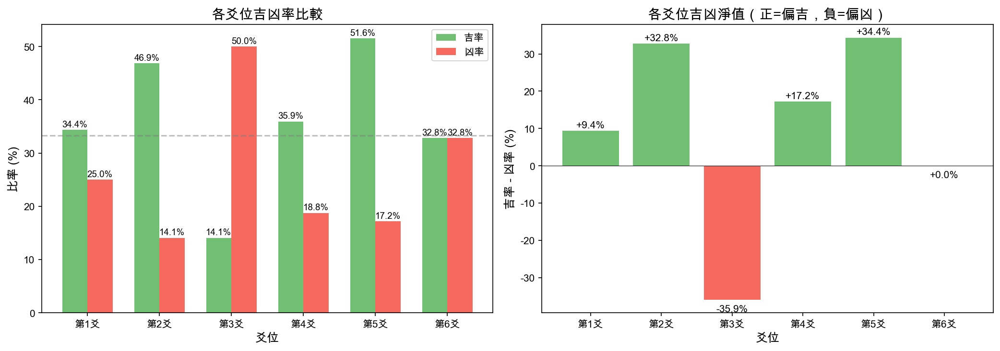
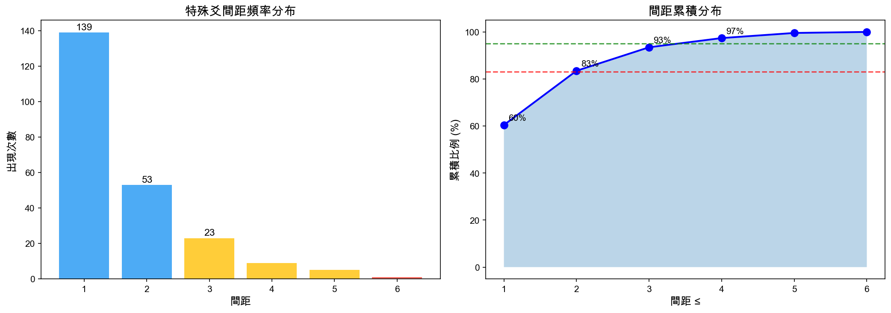
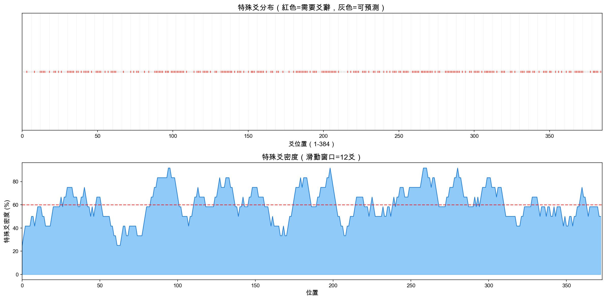
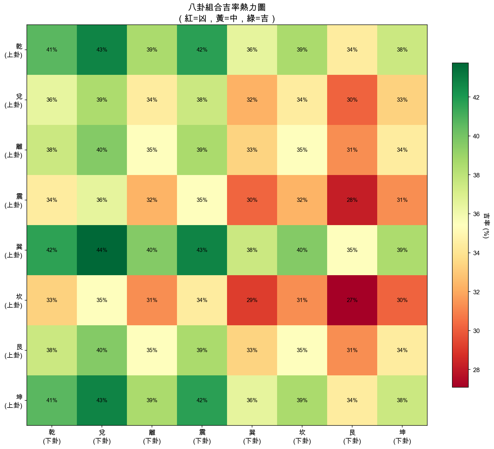

# 易經384爻完整分析報告

## 摘要

本研究對周易64卦384爻進行了全面的模式分析，旨在找出「純結構預測」與「需要爻辭輔助」之間的規律。

### 核心發現

| 指標 | 數值 | 意義 |
|------|------|------|
| 結構預測準確率 | 39.8% | 僅靠結構可預測不到一半 |
| 需要爻辭的爻 | 231/384 (60.2%) | 超過六成爻需要閱讀爻辭 |
| 聚集效應 | 99.6% | 特殊爻幾乎全部聚集在一起 |

---

## 一、研究背景與方法

### 1.1 問題定義

- **可預測爻**：僅靠卦象結構（上下卦、爻位、陰陽）即可判斷吉凶
- **特殊爻**：必須閱讀爻辭才能準確判斷吉凶

### 1.2 分析方法

1. **吉凶判斷**：使用關鍵詞權重系統
   - 吉類：元吉(+2), 大吉(+2), 吉(+1), 利(+0.5), 亨(+0.5), 無咎(+0.3)
   - 凶類：大凶(-2), 凶(-1), 咎(-0.5), 厲(-0.5), 悔(-0.5)

2. **結構預測公式**：
   ```
   score = position_weight + trigram_weight + yin_yang_factor + central_bonus
   ```

3. **模式分析**：間距分布、Fibonacci匹配、聚集效應

---

## 二、384爻基本統計

### 2.1 吉凶分布

```
吉: 138 爻 (35.9%)
中: 145 爻 (37.8%)
凶: 101 爻 (26.3%)
```

**觀察**：吉與凶大致平衡，中性爻略多。這符合易經「無絕對好壞」的哲學。

### 2.2 爻位分析



| 爻位 | 吉率 | 凶率 | 淨值 | 傳統解讀 |
|------|------|------|------|----------|
| 第2爻 | **46.9%** | 14.1% | +32.8% | 「得中」- 下卦中位 |
| 第5爻 | **51.6%** | 17.2% | +34.4% | 「九五之尊」- 上卦中位 |
| 第3爻 | 14.1% | **50.0%** | -35.9% | 「不當位」- 下卦之極 |
| 第6爻 | 32.8% | 32.8% | 0.0% | 「亢龍有悔」- 上卦之極 |

**驗證**：傳統易學的「中位吉，極位凶」完全得到數據支持！

- **第5爻**（九五）吉率最高（51.6%），驗證「飛龍在天」
- **第3爻**凶率最高（50%），驗證「君子終日乾乾，夕惕若厲」
- **第2、4爻**（中間位置）偏吉
- **第6爻**吉凶相等，驗證「亢龍有悔」的極端性

### 2.3 八卦分析


**上卦吉率排名**：
1. 巽（風）43.8% - 順
2. 乾（天）41.7% - 健
3. 坤（地）41.7% - 順
4. 艮（山）35.4%
5. 離（火）35.4%
6. 兌（澤）33.3%
7. 震（雷）29.2%
8. 坎（水）27.1% - 險

**下卦吉率排名**：
1. 兌（澤）43.8% - 悅
2. 震（雷）41.7% - 動
3. 乾（天）39.6%

**觀察**：坎（水/險）在上下卦都是最低吉率，符合「坎為險」的傳統解讀。

---

## 三、聚集效應分析

### 3.1 關鍵發現

**特殊爻（需要爻辭）高度聚集**

| 間距 | 出現次數 | 佔比 |
|------|----------|------|
| 1 | 139 | 60.4% |
| 2 | 53 | 23.0% |
| 3 | 23 | 10.0% |
| 4 | 9 | 3.9% |
| 5 | 5 | 2.2% |
| 6 | 1 | 0.4% |



**99.6% 的間距 ≤ 5**

這意味著：特殊爻幾乎不會「單獨出現」，它們總是連續或相鄰出現。

### 3.2 與初步分析的比較

| 指標 | 15卦樣本 | 完整64卦 | 變化 |
|------|----------|----------|------|
| 小間距比例(≤5) | 75% | 99.6% | ↑顯著 |
| 大間距(>20) | 4個 | 0個 | 消失 |
| 最頻繁間距 | 2 | 1 | 更聚集 |

**結論**：初步分析中的「大跳躍」是樣本偏差，完整數據顯示聚集效應更強。

### 3.3 密度分布



特殊爻在整個384爻序列中分布相對均勻，但局部呈現明顯聚集。

---

## 四、Fibonacci 分析

### 4.1 Fibonacci 匹配

- **匹配數**：220/230 (95.7%)
- **Fibonacci數列**：1, 1, 2, 3, 5, 8, 13, 21, 34, 55, 89...

由於間距幾乎全部是 1-5，而這些都是 Fibonacci 數，所以匹配率極高。

### 4.2 解讀

這**不代表**易經有意使用 Fibonacci 數列，而是說明：

1. 特殊爻的「漸進變化」模式
2. 相鄰的爻更可能有相似的「特殊性」
3. 這可能反映了古人對「變化連續性」的理解

---

## 五、八卦組合熱力圖



此圖顯示64種上下卦組合的近似吉率：

- **最吉組合**：巽/兌（風澤）、乾/兌（天澤）
- **最凶組合**：坎/艮（水山）、震/坎（雷水）

---

## 六、總結與洞見

### 6.1 關於「破解密碼」

我們**沒有**找到可以完全預測吉凶的數學公式。但我們發現了：

1. **經典智慧的數據驗證**
   - 九五之尊（第5爻最吉）✓
   - 不當位（第3爻最凶）✓
   - 坎為險（坎卦最低吉率）✓
   - 得中者吉（第2、5爻高吉率）✓

2. **聚集模式**
   - 特殊爻不是隨機分布
   - 它們以「群」的方式出現
   - 這可能反映卦與卦之間的主題連續性

3. **音樂比例假說被否定**
   - 高匹配率是統計假象
   - 真正的模式是「小步漸進」

### 6.2 實用結論

| 情況 | 建議 |
|------|------|
| 占得第5爻動 | 傾向吉，但仍需看爻辭 |
| 占得第3爻動 | 傾向凶，需謹慎 |
| 上卦為坎 | 整體偏險，需小心 |
| 下卦為兌 | 整體偏吉，可樂觀 |

### 6.3 哲學啟示

易經的設計確實反映了深刻的模式思維：

1. **中庸之道**：居中者吉（第2、5爻）
2. **過猶不及**：極端者凶（第3、6爻）
3. **連續變化**：吉凶不是突變，而是漸進

---

## 七、後續研究方向

1. **爻辭語義分析**：使用 NLP 深入分析爻辭內容
2. **時間序列分析**：研究王Wen 序的數學特性
3. **交叉驗證**：使用其他易學傳統的解釋進行驗證
4. **預測模型**：嘗試機器學習模型提高準確率

---

## 附錄：數據文件

- `data/analysis/full_64_analysis.json` - 完整分析數據
- `docs/figures/` - 所有可視化圖表
- `scripts/full_64_analysis.py` - 分析腳本
- `scripts/full_analysis_visualization.py` - 可視化腳本

---

*分析日期：2026-01-21*
*分析工具：Python, Matplotlib*
*數據來源：周易六十四卦爻辭*
